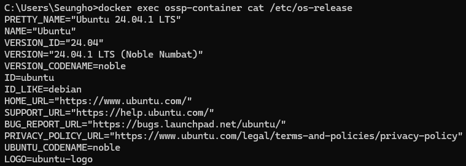
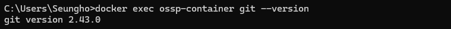
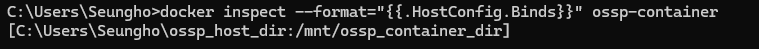

# SWE_2021_41_2024_2_week_6
---
## Week 4 Assignment
* Link of repository
>https://github.com/kwonseungho0514/SWE_2021_41_2024_2_week_4
* Code
>```Python
>history = []
>
>def isHappy(n):
>  if (n < 1 or n > pow(2,31) - 1):
>    return False
>
>  while(in_history(n) != True):
>    history.append(n)
>    n = next_n(n)
>
>  if (n == 1):
>    return True
>  else:
>    return False
>
>def in_history(n):
>  for i in range(len(history)):
>    if (n == history[i]):
>      return True
>  return False
>
>def next_n(n):
>  nums = []
>  sum = 0
>
>  while(n != 0):
>    nums.append(n % 10)
>    n= n // 10
>  for i in range(len(nums)):
>    sum += nums[i] * nums[i]
>  return sum
>
>num = (int)(input())
>print(isHappy(num))
>```

* Description of code
> 먼저 입력된 n이 범위에서 벗어난 값인지 확인한다. \
> 만약 범위 내의 값이라면 n이 Happy Number인지 확인한다.\
> 여기서 **Happy Number**란 정수의 각 자리값을 더해서 새로운 정수를 만드는 과정을 반복할 때 특정한 값들이 반복되는 loop가 만들어 지고 그 값이 1로 수렴하는 수를 말한다.\
> 새롭게 만들어진 정수들은 history라는 array에 저장되고 기록된다.\
> **in_history** 함수는 새로 만들어진 정수가 이전의 정수들에서 등장한 수인지 확인하고 loop이 만들어 졌으면 True를 아니면 False를 return한다.\
> **next_n** 함수는 정수의 각 자리수를 더해서 만든 새로운 정수를 리턴한다. \
> **isHappy** 함수는 in_history함수를 이용해서 입력된 정수가 loop를 만들었는지 확인한다.\
> 만약 만들지 않았다면 n을 next_n함수를 이용해서 다음 단계의 n으로 바꾸고 loop가 생길때까지 이 과정을 반복한다.\
> 만약 이렇게 반복되는 loop값이 1이라면 Happy Number에 해당되므로 True를 반환하고 그렇지 않다면 False를 반환한다.
---
## Week 5 Assignment

> ```Shell
> docker exec ossp-container cat /etc/os-release
> ```
> ossp-container에 접속하여 현재 os의 이름과 버전을 확인할 수 있는 commandline이다.이에 따른 실행결과는 다음과 같으며 이름은 "Ubuntu"이고 버전은 "24.04.1 LTS (Noble Numbat)"임을 알 수 있다.  
> 

> ```Shell
> docker exec ossp-container git --version
> ```
> ossp-container에 접속하여 현재 설치된 git의 버전을 확인할 수 있는 commandline이다. 이에 따른 실행결과는 다음과 같으며 2.43.0 버전임을 알 수 있다.  
> 

> ```Shell
> docker exec ossp-container python3 --version
> ```
> ossp-container에 접속하여 현재 설치된 python3의 버전을 확인할 수 있는 commandline이다. 이에 따른 실행결과는 다음과 같으며 3.12.3 버전임을 알 수 있다.  
> 

> ```Shell
> docker inspect --format="{{.HostConfig.Binds}}" ossp-container
> ```
> ossp-container의 세부 정보중 mount directory를 확인할 수 있는 commandline이다. 이에따른 실행결과는 다음과 같으며 [C:\Users\Seungho\ossp_host_dir:/mnt/ossp_container_dir]임을 알 수 있다.  
> 
